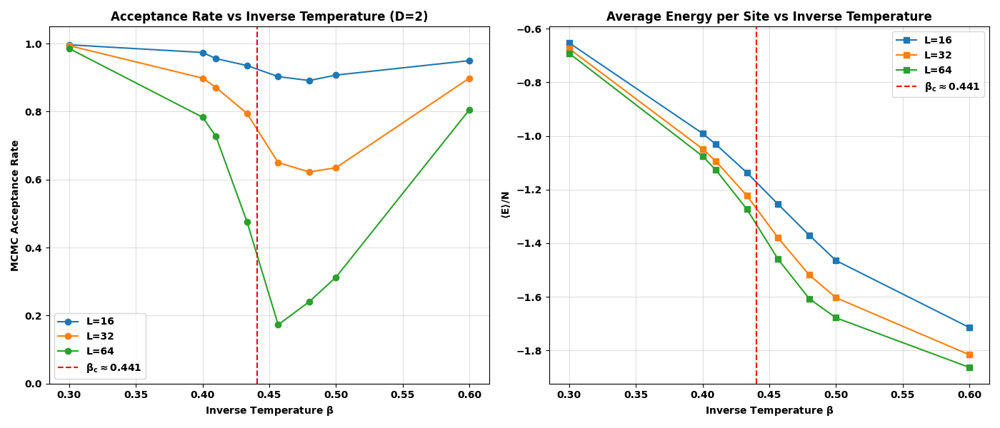

# Tensor-Network Monte Carlo — ICFO internship

Work done during my internship at ICFO (Institut de Ciències Fotòniques), under the supervision of Dr. Miguel Frías-Pérez.

I developed my own basic MPS/PEPS algorithms both in Python with NumPy only, and once in Julia on top of ITensors, and used it to reproduce the main numerical results of the paper my supervisor co-authored:

> M. Frías-Pérez, M. Mariën, D. Pérez-García, M. C. Bañuls and S. Iblisdir,
> *Collective Monte Carlo updates through tensor network renormalization*,
> **SciPost Phys. 14, 123 (2023)**, [doi:10.21468/SciPostPhys.14.5.123](https://doi.org/10.21468/SciPostPhys.14.5.123)

---

## What the algorithm does

We want to sample the Boltzmann distribution of the 2D classical Ising model,
`π(σ) ∝ e^{−βH(σ)}` with `H = −J Σ_⟨ij⟩ σ_i σ_j`.

The trick from the paper is to write the partition function `Z` as a PEPS (a 2D tensor
network) and contract it row by row with a boundary MPS truncated to bond dimension
`D_bound`. That contraction is approximate, but it is cheap and it gives you the
conditional probability of every spin, so you can sample a whole lattice configuration
in one shot from a distribution `q` that is already very close to `π`.

That sampled configuration is then used as the proposal of a Metropolis-Hastings step.
Because the proposal ignores the current state, the acceptance is just

```
A(x → y) = min(1, [π(y)/q(y)] · [q(x)/π(x)])
```

Because updates modify the entire lattice simultaneously rather than spin by spin, the algorithm avoids the severe critical slowing down of standard local Metropolis sampling.

## What I reproduced

The benchmark from the paper: acceptance rate and energy per site across the phase
transition, for `L = 16, 32, 64` at `D_bound = 2`.



Acceptance stays high everywhere except for a dip right at `β_c = ln(1+√2)/2 ≈ 0.441`,
and the dip deepens as the lattice grows, which is exactly the behaviour described in the paper.
The energy curve bends at the same point, which is the phase transition showing up.

Along the way I also checked the pieces separately: the approximate PEPS contraction
against exact brute-force contraction (error vs lattice size and vs `D_bound`), and the
MPS code against known states (GHZ, W).

---

## The code

### Python — `py/` (NumPy only, plus `opt_einsum` for contraction order)

| file | what's in it |
|---|---|
| `matrix_product_states.py` | `MPS` class: canonical forms via QR, amplitudes, norms, expectation values, MPO application, SVD compression |
| `peps.py` | `PEPS` class: the 2D network, boundary-MPS contraction, exact contraction for cross-checks, the Ising PEPS constructor, and the row-by-row sampler |
| `Z_simulation.py` | approximate vs exact partition function across β |
| `PEPS_simulation.py` | contraction accuracy vs lattice size |
| `MPS_simulation.py` | MPS sanity checks |
| `TNMH.py`, `TNMH_v2.py`, `indep_sampling.py` | the Metropolis–Hastings chain built on the sampler |
| `critial_point_sim.py` | the phase-transition sweep — the figure above |

```bash
cd py
pip install numpy matplotlib opt_einsum tqdm
python critial_point_sim.py
```

### Julia — `jl/icfo_intern/` (ITensors)

| file | what's in it |
|---|---|
| `main.jl` | the whole thing: Ising PEPS construction, bottom-environment pre-computation, the 1D classical sampler, the full 2D sampler, and the MH sweep |
| `TNMH_test.ipynb` | the phase-transition sweep — run it, or just reload the saved data and plot |
| `ising_mcmc_results_D2.jld2` | the saved `L = 16, 32, 64` sweep (≈ 14 h of compute, so you don't have to redo it) |

```bash
cd jl/icfo_intern
julia --project=.        # first time: julia> using Pkg; Pkg.instantiate()
```

Versions are pinned in `Project.toml` / `Manifest.toml` (ITensors 0.9.25, ITensorMPS 0.3.45).

---

## Notes

- Both implementations do the same. The Python one is more readable if you want to
  see how a boundary-MPS contraction actually works; the Julia one is the one to run.
- Only ferromagnetic Ising with open boundary conditions is implemented, but the paper
  also covers other instances (antiferromagnetic, frustrated and spin-glass) and 3D.

*Joaquín G. Márquez Olguín*
